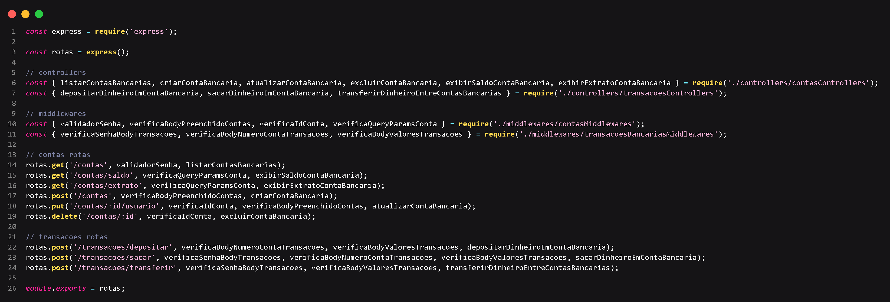

<p align="center"><b>Projeto API Sistema Bancário - Node.js</b></p>

## 📝Sobre

Projeto de finalização do segundo módulo do curso de desenvolvimento de software, com foco em Back-end, da Cubos academy. Este projeto visa exercitar e avaliar todos os conhecimentos adquiridos ao longo do módulo 2 do curso (API REST), sendo alguns desses conceitos:
- API Rest
- Programação assíncrona
- Function Async/await
- CRUD
- JSON
- Fs/promises
- Persistência de dados
- Framework Express.js
- Datas em Javascript
- Date-fns

## ⚙️Funcionalidades
- Rota GET /contas/ para listar contas bancárias com validação da senha do banco
- Rota GET /contas/saldo/ para exibir o saldo bancário do usuário com validação da senha do usuário
- Rota GET /contas/extrato/ para exibir o extrato bancário do usuário com validação da senha do usuário
- Rota POST /contas/ para adicionar uma nova conta ao arquivo contas.json do banco de dados com verificações
- Rota PUT /contas/:id/usuario/ para alterar dados da conta através do ID informado e JSON com todos os dados da conta
- Rota DELETE /contas/:id/ para remover conta através do ID informado
- Rota POST /transacoes/depositar para fazer o depósito de dinheiro em centavos ao saldo do usuário e registro do depósito no arquivo depositos.json
- Rota POST /transacoes/sacar para retirar dinheiro em centavos do saldo do usuário, com validação da senha do usuário e registro do saque no arquivo saques.json
- Rota POST /transacoes/transferir para transferir dinheiro em centavos do saldo de um usuário para o outro, com validação da senha do usuário de origem e registro no arquivo transferencias.json
- Formatação de datas utilizando a biblioteca Date-fns
- Persistência de dados com fs/promises

## 👨🏽‍💻Tecnologias
- Javascript
- Node.js
- Express.js

## 🔧Requisitos
- npm instalado na sua máquina
- node instalado na sua máquina
- editor de código instalado na sua máquina (recomendação: Visual Studio Code)

## 🖥️Como instalar
- Clone este repositório em qualquer pasta que desejar
- Abra o seu terminal na mesma página criada e digite:
```
npm install
```

Após esperar um tempo, todas as dependências para rodar este server estarão instaladas
- Agora você só precisa iniciar um server de desenvolvimento escrevendo
```
npm run dev
```
**Lembre-se, este projeto não utiliza um banco de dados.**

## 🧭Rotas
- [GET] /contas
- [GET] /contas/saldo
- [GET] /contas/extrato
- [POST] /contas
- [PUT] /contas/:id/usuario
- [DELETE] /contas/:id
- [POST] /transacoes/depositar
- [POST] /transacoes/sacar
- [POST] /transacoes/transferir

